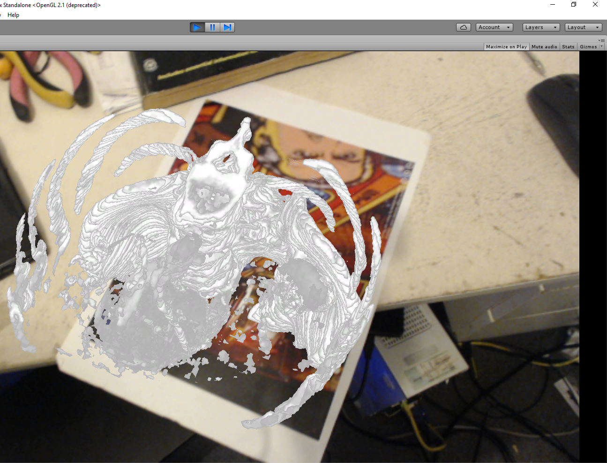
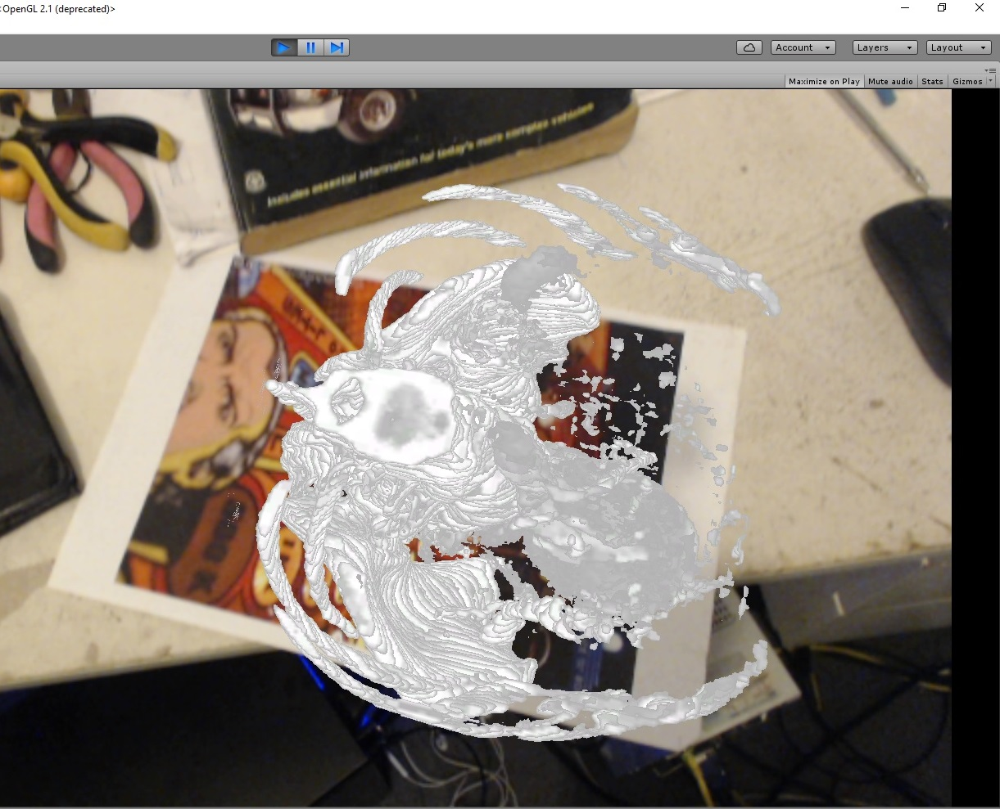

# DocAR
Test MRI slice viewer AR interface written for Unity Engine backend NFT and tracking provided by ARToolkit.

Big thankyou to the ARToolkit team for providing the toolkit and my friend Daniel LaVista for assisting me with Unity Engine and Programming, Cheers!

Written for AR Summer School '16 at UniSA Adelaide

Copyright (C) 2016 Mr Gerallt G. Franke, Daniel LaVista 

Example 1:

Example 2:

